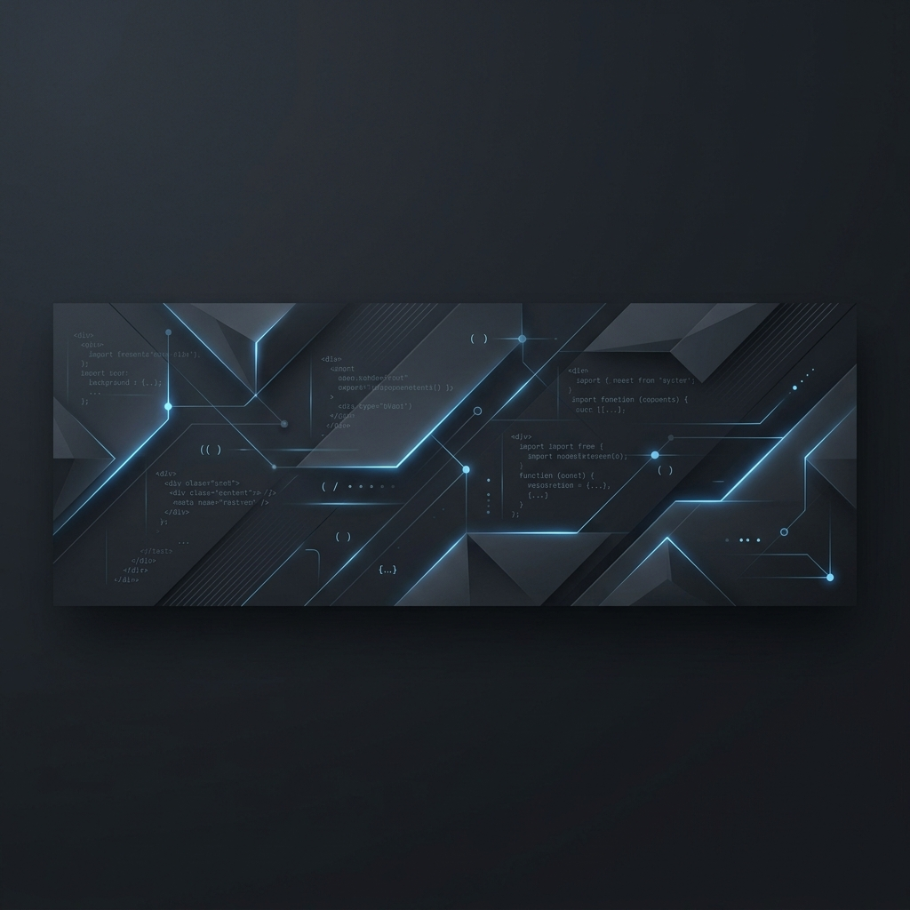

  

  
  &nbsp;
  
  &nbsp;
  
  &nbsp;
  

  
  &nbsp;
  
  &nbsp;
  

---

## Know About Me

<table>
  <tr>
    <td width="35%" valign="top">
      
    </td>
    <td width="65%" valign="top">
      
Olá, sou o <b>Guilherme Felix</b>.

      
Trabalho com desenvolvimento backend focado em Python e na criação de APIs eficientes, escaláveis e fáceis de manter. Gosto de resolver problemas de forma simples e direta, sem complicar o código.

      
Tenho experiência na estruturação de APIs RESTful usando frameworks modernos, modelagem e otimização de bancos de dados relacionais (SQL), além de automatizar rotinas e processos quando realmente faz sentido para o fluxo de desenvolvimento ou de negócios.

      
Acredito que escrever código limpo e bem estruturado é fundamental para a evolução saudável de qualquer software.

    </td>
  </tr>
</table>

---

## Technical Arsenal

  
  &nbsp;
  
  &nbsp;
  
  &nbsp;
  
  &nbsp;
  
  &nbsp;
  
  &nbsp;
  
  &nbsp;
  
  &nbsp;
  

<table>
  <tr>
    <td width="33.3%" valign="top">
      <b>Backend & APIs</b> 
      Desenvolvimento de APIs RESTful robustas utilizando FastAPI, Flask e Django, aplicando boas práticas de Clean Code, arquitetura limpa e documentação automática com Swagger/OpenAPI.
    </td>
    <td width="33.3%" valign="top">
      <b>Banco de Dados & SQL</b> 
      Modelagem relacional de dados, estruturação e otimização de consultas SQL. Experiência prática com bancos como PostgreSQL e SQLite integrados via ORMs (SQLAlchemy, SQLModel).
    </td>
    <td width="33.3%" valign="top">
      <b>DevOps & Automações</b> 
      Conteinerização com Docker para padronização de ambientes de desenvolvimento, versionamento inteligente usando Git/GitHub e automação de pipelines com GitHub Actions.
    </td>
  </tr>
</table>
